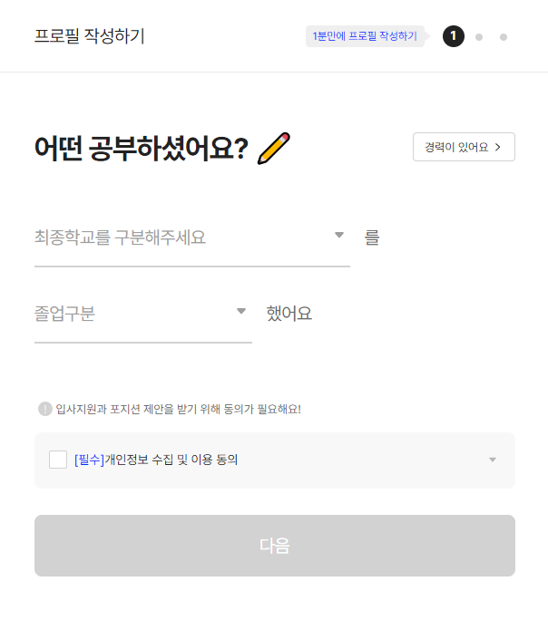
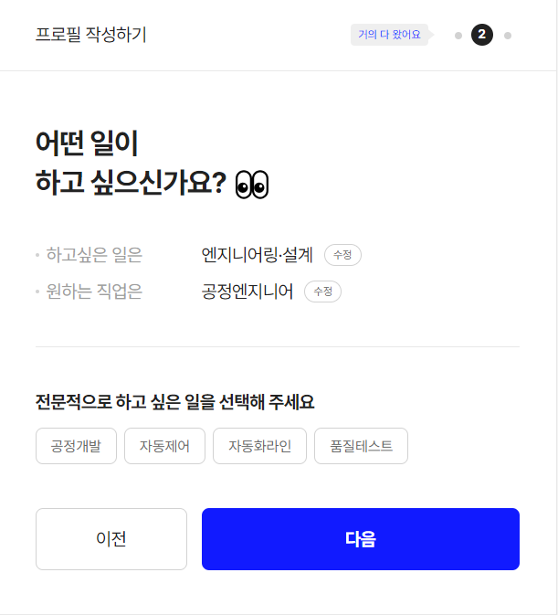
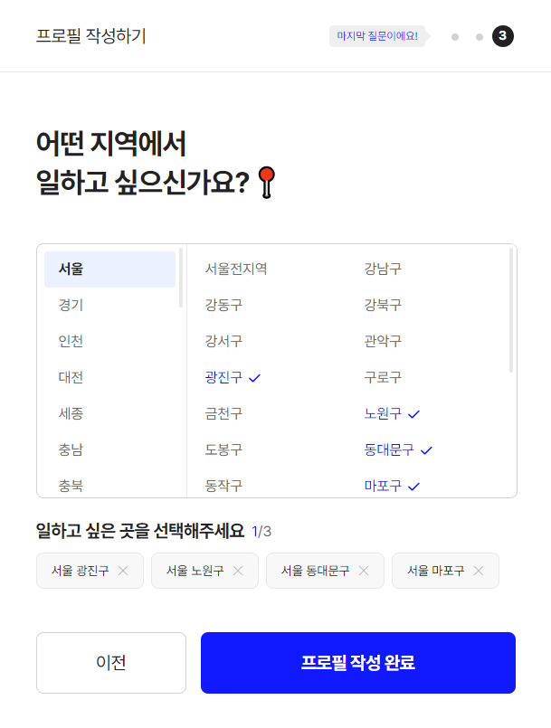
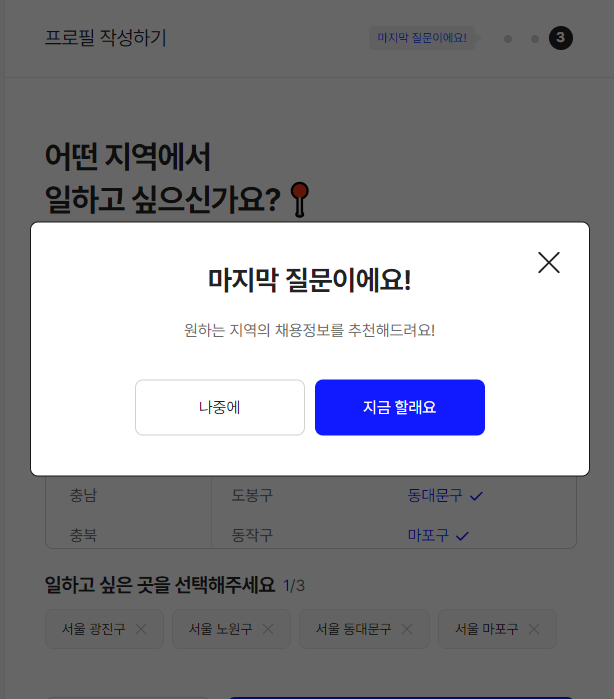
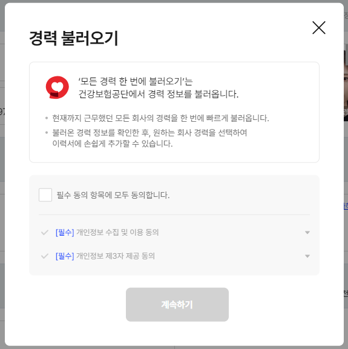
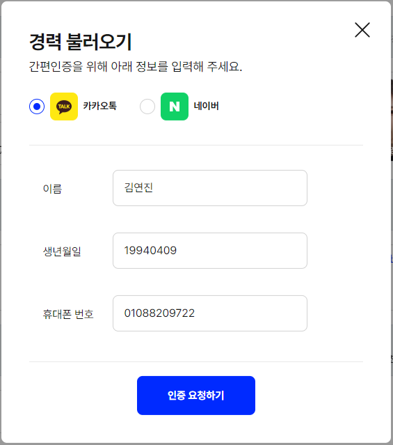
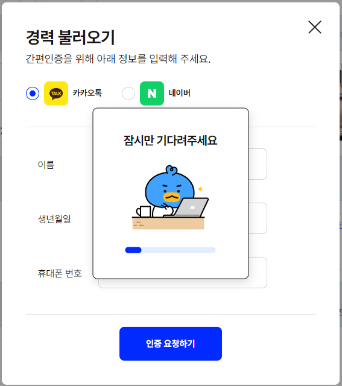
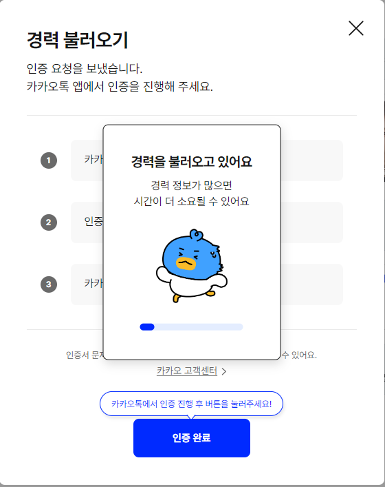
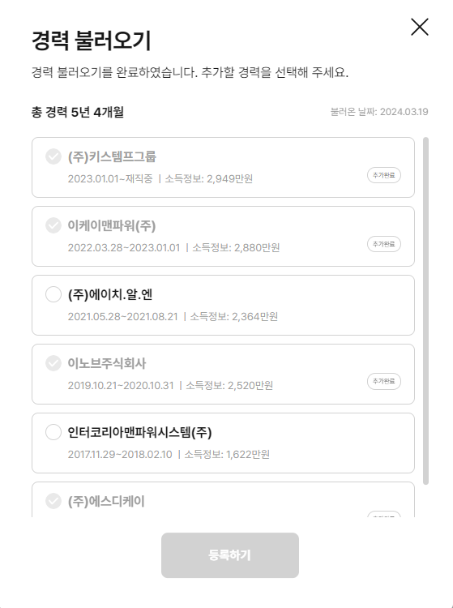
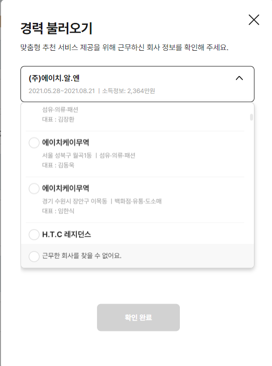

# 📂 김연진 포트폴리오

> 김연진(Yeonjin Kim) - zziinnn 포트폴리오 
<br />

# 🖋 Intro
> 안녕하세요! ***"도움이 되는 직원으로 성장하고 싶은"*** 3년차 퍼블리셔 김연진입니다. <br />
> 최근 2년 동안 잡코리아의 UI 개발 부서에서 구축 및 유지보수 작업을 통해 퍼블리셔로서의 역량을 키워왔으며,  <br />
> 배움을 통한 즐거움과 협업의 가치를 이해하며 지속적으로 성장하고 있습니다.
<br />

# 🖥 Projects

### ✔ 원픽
> - 담당업무 : 잡코리아 원픽 개편 / 원픽 페이지 검수 지원
> - 퍼블리싱 : 지원자관리 영역 100% / 원픽 페이지 40%
> - 작업기간 : 1개월
> - Skill :   
>
>
- ### ✔ 잡코리아 내재역량테스트(MICT) 
> - 담당업무 : MICT 개선잡업
> - 퍼블리싱 : 50%
> - 작업기간 : 1주
> - Skill :  
<br />

### ✔ 잡코리아 프로필 등록
> - 담당업무 : 프로필 등록을 위한 팝업창 구축 및 유지보수
> - 퍼블리싱 : 100%
> - 작업기간 : 2개월
> - Skill :   
<br />
 
- #### 잡코리아 프로필 등록 주요코드

``` C
var selectboxOptions = document.querySelectorAll('.line-box .selectbox-option');
var lineBoxes = document.querySelectorAll('.line-box');

//외부 클릭 시 리스트 닫기
document.addEventListener('mouseup', function (e) {
    lineBoxes.forEach(function (lineBox) {
        if (!lineBox.contains(e.target)) {
            lineBox.classList.remove('on');
            var otherSelectboxOptions = lineBox.querySelectorAll('.selectbox-option');
            otherSelectboxOptions.forEach(function(otherSelectboxOption) {
                otherSelectboxOption.classList.remove('active');
            });
        }
    }); 
});

//selectbox-option 리스트 열김 겹침 제어 + 열고 닫기 + arrow iocn 제어
lineBoxes.forEach(function(lineBox) {
    lineBox.addEventListener('click', function() {
        lineBox.classList.toggle('on');
        selectboxOptions.forEach(function(selectboxOption) {
            selectboxOption.classList.toggle('active');
        });
        lineBoxes.forEach(function(otherLineBox) {
            if (otherLineBox !== lineBox) {
                otherLineBox.classList.remove('on');
                var otherSelectboxOptions = otherLineBox.querySelectorAll('.selectbox-option');
                otherSelectboxOptions.forEach(function(otherSelectboxOption) {
                  otherSelectboxOption.classList.remove('active');
                });
            }
        });
    });
});
```

###### 갼략 캡쳐본
<table>
  <tbody>
    <tr>
      <td>
        
      </td>
      <td>
        
      </td>
      <td>
        
      </td>
      <td>
        
      </td>
      <td>
        
      </td>
    </tr>
  </tbody>
</table>
<br />

### ✔ 건강보험공단 경력 불러오기
> - 담당업무 : 편리한 이력서 등록을 위한 팝업창 구축 및 유지보수
> - 퍼블리싱 : 100%
> - 작업기간 : 2주
> - Skill :   
<br />

- #### 건강보험공단 경력 불러오기 주요코드

``` C
// 경력불러오기 DB 토글
    document.querySelectorAll('.info-wrap').forEach(function(infoWrap) {
        infoWrap.addEventListener('click', function() {
            var hiddenWrap = this.querySelector('.hidden-wrap');
            var allHiddenWraps = document.querySelectorAll('.hidden-wrap');
            var allInfoWraps = document.querySelectorAll('.info-wrap');

            // 다른 .info-wrap 요소들에서 on 클래스 제거
            allInfoWraps.forEach(function(item) {
                if (item !== this) {
                    item.classList.remove('on');
                }
            }, this);
    
            // 기존에 열려있는 .hidden-wrap 요소들을 닫음
            allHiddenWraps.forEach(function(item) {
                if (item !== hiddenWrap) {
                    item.classList.remove('active');
                }
            });
    
            // 클릭한 .info-wrap 요소의 .hidden-wrap 요소가 존재하는지 확인 후 토글
            if (hiddenWrap) {
                hiddenWrap.classList.toggle('active');
            }
    
            // 클릭한 .info-wrap 요소에 on 클래스를 토글
            this.classList.toggle('on');
        });
    });
```

###### 갼략 캡쳐본
<table>
  <tbody>
    <tr>
        <td>
          
        </td>
        <td>
          
        </td>
        <td>
          
        </td>
    </tr>
    <tr>
        <td>
          
        </td>
        <td>
          
        </td>
        <td>
          
        </td>
    </tr>
  </tbody>
</table>
<br />

# 🚀 Skills
  
 
  

 

<br />
<br />

# 📞 Contact
- 이메일 : 1994being@naver.com
- 연락처 : 010.8820.9722
- 깃허브 : <a href="https://github.com/zziinnn">
  
  </a>
